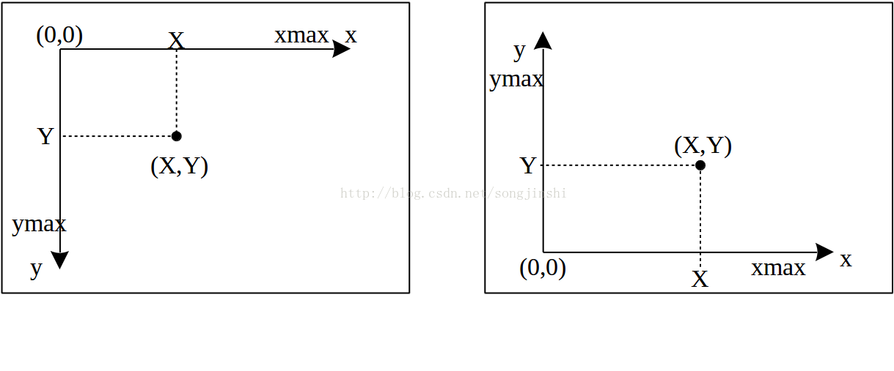

### 贪吃蛇知识点
1. 屏幕坐标系：在计算机中，**图形界面的坐标系原点（0, 0）通常在窗口的左上角**，x轴从左往右增加，y轴从上往下增加。
3. `canvas.delete("food")`是删除food这个标签 
3. `f"{window_width}x{window_height}+{x}+{y}"`这是一个格式化字符串（f-string）其中的值随变量变化
4. for循环等需要添加：
5. 三引号的作用，在面对需要保留特殊格式输出的时候可以用到  
```
str1 = """List of name:
... Hua Li
... Chao Deng
... """
 print(str1)
List of name:
Hua Li
Chao Deng
```
6.当需要修改全局变量时，需要再次调用`global`,如果只是调用，则不需要